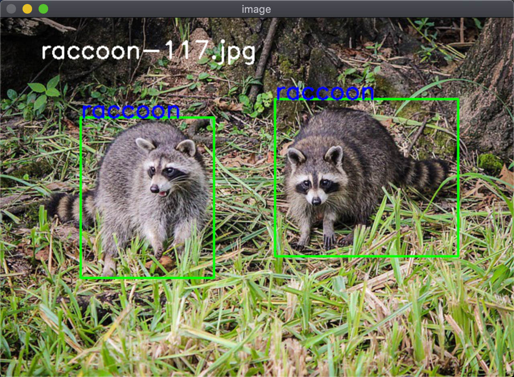
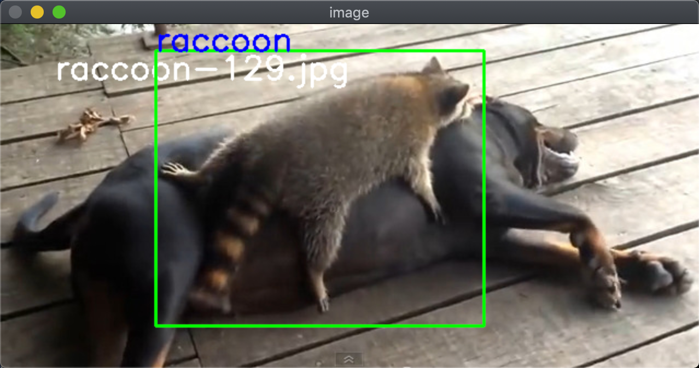

# Pascal VOC Visualizer

A simple utility that will read Pascal VOC annotation files and display the regions of interest in a window.





## Dataset credit

[datitran](https://github.com/datitran/raccoon_dataset)


## Usage

```text
python PascalVOCVisualizer.py --annotation-root-dir ./raccoons/annotations --images-root-dir ./raccoons/images
```

* Space bar to move to the next image in the directory

* 'q' to quit the viewer


# Visualize VOC Format Data

Leveraging [this Github Repo](https://github.com/rmalav15/visualize-voc-format-data), I am extending it to remove some of the hard coded assumptions and make it more flexible, but the bulk of the credit goes to the author of that [Github Repo](https://github.com/rmalav15/visualize-voc-format-data).

